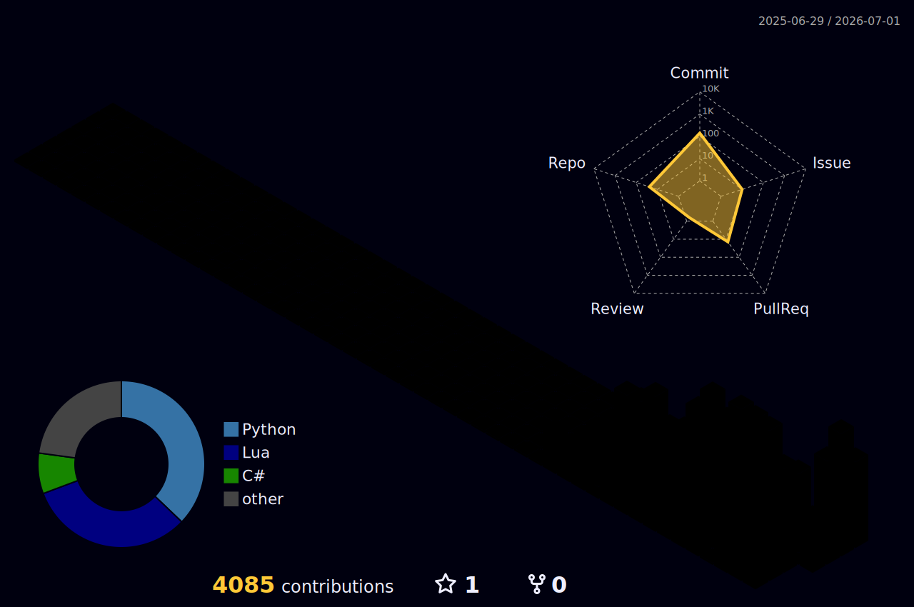

# ywkuno

I build local-first AI developer tools, open source game-streaming forks,
desktop experiments, and game/mod utilities.

My current focus is **CodePrism** and **Nimbus**: tools and systems that help
developers inspect large codebases, keep AI-assisted work grounded, and make
home game streaming more reliable for real users.

<p>
  <a href="https://github.com/kunolabs/codeprism"></a>
  <a href="https://github.com/kunolabs/Nimbus"></a>
  
  
  
  
  
  
</p>

<p align="center">
  <a href="https://skillicons.dev">
    
  </a>
</p>

<p align="center">
  <picture>
    <source media="(prefers-color-scheme: dark)" srcset="./profile-3d-contrib/profile-night-rainbow.svg" />
    <source media="(prefers-color-scheme: light)" srcset="./profile-3d-contrib/profile-gitblock.svg" />
    
  </picture>
</p>

<p align="center">
  
  
</p>

## Featured

### [CodePrism](https://github.com/kunolabs/codeprism)

Local-first context saving and token optimization for AI coding agents.

```bash
codeprism prime "what I am changing" --changed
codeprism query "where does this behavior live?"
codeprism visualize
```

CodePrism turns a repository into an inspectable graph before an assistant reads
the whole tree. It exports Markdown, JSON, DOT, SQLite, and a static browser
viewer so the context path stays visible instead of hidden inside a chat window.

### [Nimbus](https://github.com/kunolabs/Nimbus)

Community-maintained game streaming host fork based on the Vibepollo, Apollo,
and Sunshine lineage.

Nimbus is the host side of my game-streaming work: virtual display reliability,
Windows capture behavior, frame pacing, Android TV compatibility, release
hygiene, and public maintainer practices. The goal is to make the fork useful to
people who actually stream from a gaming PC to living-room and handheld clients.

### Lucent

Planned companion client track for the Artemis/Moonlight Android lineage.

Lucent is the client-side direction I want to grow after the Nimbus host
foundation is stable: Android TV polish, controller ergonomics, reliable pairing,
and clear compatibility with Nimbus, Artemis, and Moonlight where possible.

## What I Am Building Toward

- Local-first AI tooling that works before it talks to the network.
- Codebase maps, slices, and replay artifacts that make agent work inspectable.
- Game streaming forks with honest release notes and reproducible builds.
- Desktop tools that are practical for non-technical users.
- Game and mod utilities that favor readability, stability, and fast iteration.

## Stack I Reach For

```text
Python      TypeScript  JavaScript  Node.js
SQLite      GitHub Actions           PowerShell
C++         CMake       Java         C#
Lua         Godot       Vue          React
Tailwind    Three.js    Tauri        Docker
```

## Operating Principles

- Map first, then read.
- Keep useful artifacts inspectable.
- Prefer deterministic parsing before heavy magic.
- Measure before making performance or token-saving claims.
- Make public maintenance boring, transparent, and repeatable.
- Build tools that stay useful when the network is off.

## Public Work

- [CodePrism](https://github.com/kunolabs/codeprism) - codebase maps, context
  slices, and visual agent replay.
- [Nimbus](https://github.com/kunolabs/Nimbus) - game streaming host fork and
  public-maintenance effort.
