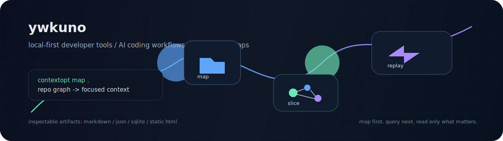
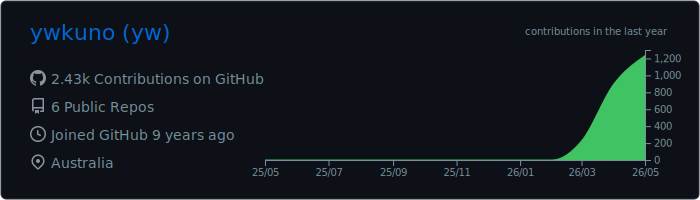
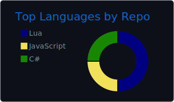
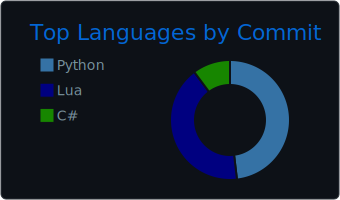
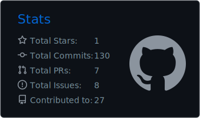
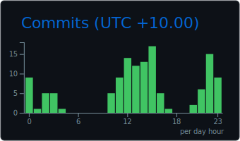

<p align="center">
  
</p>

# ywkuno

I build local-first developer tools and AI coding workflows that make large codebases cheaper to understand, slice, and act on.

My current focus is **context saving for AI agents**: deterministic repo maps, compact context slices, token estimates, and optional visual replay for understanding what an agent touched.

<p>
  <a href="https://github.com/ywkuno/cortext"></a>
  
  
  
</p>

<p align="center">
  <a href="https://skillicons.dev">
    
  </a>
</p>

<p align="center">
  <picture>
    <source media="(prefers-color-scheme: dark)" srcset="./profile-3d-contrib/profile-night-rainbow.svg" />
    <source media="(prefers-color-scheme: light)" srcset="./profile-3d-contrib/profile-gitblock.svg" />
    
  </picture>
</p>

<p align="center">
  
</p>

<p align="center">
  
  
</p>

<p align="center">
  
  
</p>

## Featured

### [Cortext](https://github.com/ywkuno/cortext)

Local-first context saving and token optimization for AI coding agents.

```bash
contextopt map .
contextopt slice "what I am changing"
contextopt visualize
```

Cortext turns a repository into an inspectable graph before an assistant reads the whole tree. It exports Markdown, JSON, DOT, SQLite, and a static browser viewer so the context path stays visible instead of hidden inside a chat window.

## Current Tracks

- **Context engineering**: repo maps, query-first context, token estimates, focused slices
- **Visual code intelligence**: optional graph viewers, activity replay, folder-aware layouts
- **Agent tooling**: local artifacts, deterministic parsing, safe activity streams
- **Practical automation**: CLIs, GitHub Actions, Windows-friendly developer workflows

## Stack I Reach For

```text
Python      SQLite      GitHub Actions
TypeScript  JavaScript  HTML/SVG
PowerShell  Git         Local-first tooling
```

## Operating Principles

- Map first, then read.
- Keep useful artifacts inspectable.
- Prefer deterministic parsing before heavy magic.
- Measure before making token-saving claims.
- Build tools that stay useful when the network is off.

## Public Work

- [Cortext](https://github.com/ywkuno/cortext) — codebase map, context pack, and visual agent replay

